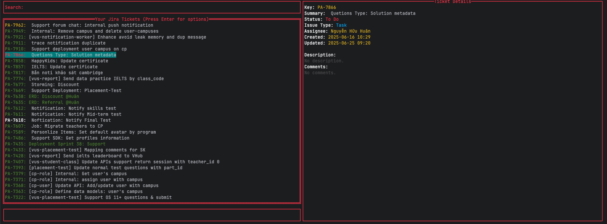

# Jira CLI

This is a simple CLI tool for interacting with Jira.

## Features

*   View your assigned Jira tickets.
*   Open tickets in your browser.
*   Generate branch names from ticket information.

## Screenshots

**List all tickets:**



**Actions in a ticket:**


## Installation

1.  **Clone the repository:**

    ```bash
    git clone https://github.com/nguyenhuuhuan/tool_jia.git
    cd jira-cli
    ```

2.  **Set up environment variables:**

    Create a `.env` file in the root of the project and add the following:

    ```
    JIRA_API_TOKEN=your-jira-api-token
    JIRA_EMAIL=your-jira-email
    ```

    You can also set these as system-wide environment variables.

3.  **Build the binary:**

    ```bash
    go build -o jira
    ```

4.  **Move the binary to your system's `bin` directory:**

    ```bash
    mv jira /usr/local/bin/
    ```

## Usage

Once the binary is in your system's `bin` directory, you can run the tool from anywhere:

```bash
jira
```

## Dependencies

*   [github.com/rivo/tview](https://github.com/rivo/tview)
*   [github.com/atotto/clipboard](https://github.com/atotto/clipboard)
*   [github.com/gdamore/tcell/v2](https://github.com/gdamore/tcell/v2)